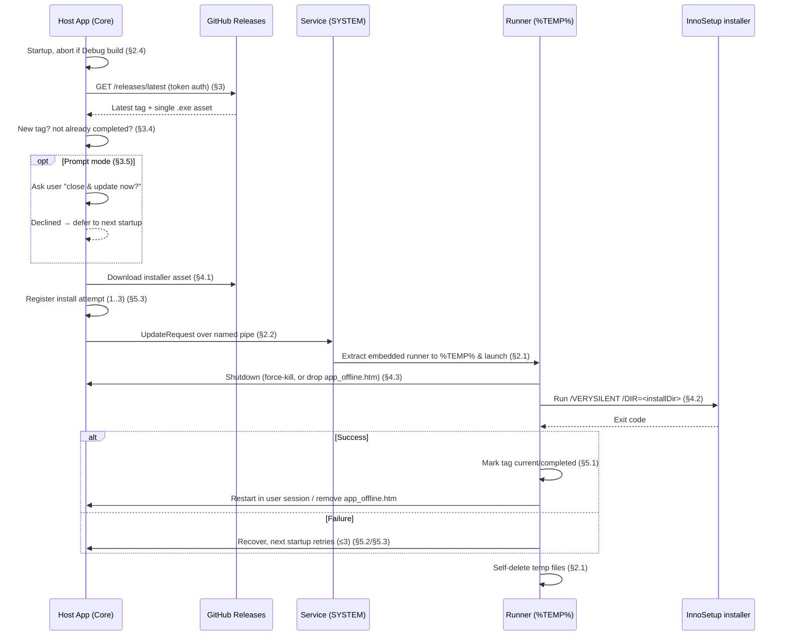

# Universal Application Updater

A **.NET 8 (Windows)** library and service that keeps deployed applications automatically up to date
from **GitHub Releases**. Drop the library into a WinForms, console, or ASP.NET Core (IIS) app, ship
a small `updater.json`, and the app silently (or with a prompt) updates itself to the latest release
on startup — including the privileged file replacement that normally requires an administrator.

> See [`specification.md`](specification.md) for the authoritative requirements. This README
> describes what is actually built in this repository.

---

## Table of contents

- [Purpose](#purpose)
- [Key features](#key-features)
- [Solution layout](#solution-layout)
- [How it works](#how-it-works)
- [Getting started](#getting-started)
- [Configuration reference](#configuration-reference)
- [Update modes: Silent vs. Prompt](#update-modes-silent-vs-prompt)
- [Building & packaging](#building--packaging)
- [Sample use cases](#sample-use-cases)
- [Requirements](#requirements)
- [Limitations & out of scope](#limitations--out-of-scope)

---

## Purpose

Auto-updating a deployed Windows application is deceptively hard:

- The running `.exe`/`.dll` files are **locked**, so an installer cannot overwrite them while the app
  runs.
- Application files often live in **protected directories** (e.g. `C:\Program Files`), so updating
  them needs **administrative privileges** the app itself usually doesn't have.
- Web apps hosted in IIS hold file locks until the worker process unloads.
- A half-applied update (power loss, full disk) can leave the app in a **corrupted state** that
  fails to start — and a naïve retry can turn that into an infinite boot loop.

This solution handles all of the above: it detects new GitHub releases, downloads the installer,
and performs the install from a **SYSTEM-level Windows Service** using a disposable **runner**
process extracted to `%TEMP%`, with per-release **retry tracking** to avoid boot loops.

## Key features

- **Drop-in client library** (`AutoUpdater.Core`) referenced by any .NET 8 Windows app.
- **GitHub Releases** as the distribution channel, with authenticated token support for **private
  repos** and higher rate limits.
- **Privileged installs** via a per-app **Windows Service running as `SYSTEM`**.
- **Lock-safe runner**: a single-file runner is embedded in the service and extracted to `%TEMP%`,
  so it can replace the locked app binaries and then self-delete.
- **Target-aware shutdown/restart**: force-close + relaunch for desktop/console; `app_offline.htm`
  for IIS web apps.
- **Silent or prompt** update modes (a turnkey WinForms confirm dialog ships in
  `AutoUpdater.WinForms`).
- **Resilient retries**: up to 3 install attempts per release tag, then the tag is abandoned to
  prevent boot loops.
- **Release-mode lock**: auto-update is disabled in Debug builds so it never interferes with
  development.
- **Logging** to a rolling file and the Windows Event Log.

## Solution layout

```
AutoUpdater.sln
├─ src/
│  ├─ AutoUpdater.Core      # NuGet-packable client library referenced by host apps
│  ├─ AutoUpdater.Service   # Per-app Windows Service (runs as SYSTEM); hosts the named-pipe server
│  ├─ AutoUpdater.Runner    # Temp "runner" exe (embedded in the service, extracted to %TEMP%)
│  └─ AutoUpdater.WinForms  # Optional: turnkey WinForms confirm dialog for Prompt mode
├─ samples/
│  ├─ SampleApp/                    # Runnable WinForms host wired up end-to-end
│  ├─ updater.json                  # Desktop/Console app, Silent mode (default)
│  ├─ updater.webapp.json           # IIS-hosted WebApp
│  └─ updater.winforms-prompt.json  # WinForms app, Prompt mode
├─ installer/
│  ├─ SampleApp.iss                 # Documented InnoSetup script (install + update payload)
│  ├─ publish.ps1                   # Publishes app + service (with embedded runner) into one folder
│  └─ README.md                     # Full distribution walkthrough
└─ specification.md                 # Requirements / design decisions
```

### Component responsibilities

| Component | Spec | Responsibility |
|-----------|------|----------------|
| `AutoUpdater.Core` | §1, §3, §6 | Config + state models, GitHub release client, named-pipe IPC contract, logging, prompt abstraction, and the `UpdaterClient` entry point the host calls at startup. |
| `AutoUpdater.Service` | §2.1–§2.3 | Per-app `SYSTEM` service. Listens on a per-app named pipe, validates requests, extracts and launches the runner. Also exposes `install`/`uninstall`/`start`/`stop` verbs for the installer. |
| `AutoUpdater.Runner` | §2.1, §4, §5 | Extracted to `%TEMP%`. Shuts down the target (force-kill or `app_offline.htm`), runs the InnoSetup installer silently, restarts the app in the user session, then self-deletes. |
| `AutoUpdater.WinForms` | §3.5 | Optional. `WinFormsUpdatePrompt` — a single Yes/No `MessageBox` used in `Prompt` mode. |

## How it works

### Roles

- **Host app + `AutoUpdater.Core`** — runs the update *check* at startup (unprivileged).
- **`AutoUpdater.Service` (SYSTEM)** — the only component with rights to write protected dirs.
- **`AutoUpdater.Runner` (`%TEMP%`)** — the disposable process that actually shuts down, installs,
  and restarts, so no permanently installed binary is locked during the swap.

These talk over a **per-app named pipe** (`AutoUpdater.<applicationId>`).

### End-to-end update flow



### Key behaviors

- **When the check runs** — strictly on application **startup** (§3.1), asynchronously so it never
  blocks the app. Once an update is confirmed, it hands off immediately on that same launch (§3.2).
- **Which release** — the repo's **"Latest"** release; drafts and pre-releases are ignored. Each
  release is expected to contain exactly **one `.exe`** asset (the InnoSetup installer) (§3.4).
- **Shutdown strategy** (§4.3):
  - *Desktop / Console* — the runner force-closes the process (after consent in Prompt mode).
  - *WebApp (IIS)* — the runner drops `app_offline.htm` into the web root to release file locks.
- **Restart strategy** (§5.1):
  - *Desktop / Console* — relaunched into the **active interactive session** via
    `CreateProcessAsUser`, preserving the original startup arguments.
  - *WebApp* — `app_offline.htm` is deleted, bringing the site back online.
- **Retries & boot-loop protection** (§5.3) — each install attempt for a tag is counted in a
  machine-wide state file. After **3** failed attempts the tag is marked *completed* (ignored) so it
  is never retried again. A declined prompt or a failed *download* does **not** consume an attempt —
  only actual install attempts do.

## Getting started

### 1. Reference the library and ship a config

Reference `AutoUpdater.Core` (and `AutoUpdater.WinForms` for prompt mode) and place an
`updater.json` next to your executable (see [Configuration reference](#configuration-reference)).

### 2. Call the updater at startup

```csharp
using AutoUpdater.Core;

// Fire-and-forget: non-blocking, and automatically disabled in Debug builds (spec §2.4).
_ = UpdaterClient.FromConfigFile().CheckForUpdatesAsync(args);
```

For prompt mode, pass a prompt (see [Update modes](#update-modes-silent-vs-prompt)).

### 3. Register the SYSTEM service from your installer

The app's installer must register the per-app service (it needs admin once). The service exposes
verbs for this:

```ini
; InnoSetup [Run]
Filename: "{app}\AutoUpdater.Service.exe"; \
  Parameters: "install --application-id MyApp"; Flags: runhidden waituntilterminated
```

Equivalent manual command:

```powershell
sc.exe create AutoUpdater.MyApp binPath= "\"C:\Program Files\MyApp\AutoUpdater.Service.exe\" --application-id MyApp" obj= LocalSystem start= auto
```

`AutoUpdater.Service.exe uninstall|start|stop --application-id MyApp` are also available.

## Configuration reference

### `updater.json` (ships with the app, spec §6.1)

| Field | Required | Description |
|-------|----------|-------------|
| `applicationId` | yes | Stable id; namespaces the service, named pipe, state and logs. |
| `repositoryUrl` | yes | GitHub repo URL, e.g. `https://github.com/org/repo`. |
| `githubToken` | for private repos / rate limits | Personal access token. **Stored in plaintext** in this iteration (§3.3). |
| `applicationType` | yes | `Desktop`, `Console`, or `WebApp`. Determines shutdown/restart strategy. |
| `updateMode` | no (default `Silent`) | `Silent` or `Prompt`. `Prompt` is valid only for `Desktop`/`Console`. |
| `installDirectory` | yes | Deployed location; passed to InnoSetup as `/DIR=`. **Must match the installer's install dir.** |
| `webRootPath` | WebApp only | Folder where `app_offline.htm` is created/deleted. |
| `serviceName` | no | Override the derived `AutoUpdater.<applicationId>` service name. |

```json
{
  "applicationId": "MyApp",
  "repositoryUrl": "https://github.com/your-org/your-repo",
  "githubToken": "ghp_xxx",
  "applicationType": "Desktop",
  "updateMode": "Silent",
  "installDirectory": "C:\\Program Files\\MyApp"
}
```

### Machine-wide state (managed automatically, spec §6.2)

Stored separately from the user config under
`%ProgramData%\AutoUpdater\<applicationId>\state.json`:

| Field | Description |
|-------|-------------|
| `currentTag` | Currently deployed release tag. |
| `retryCounts` | Per-tag install attempt counts. |
| `completedTags` | Tags that succeeded or were abandoned after 3 attempts (never retried). |

Logs are written to `%ProgramData%\AutoUpdater\<applicationId>\logs\*.log` and to the Windows Event
Log (source `AutoUpdater.<applicationId>`).

## Update modes: Silent vs. Prompt

- **`Silent` (default)** — downloads and installs in the background with no user interaction.
- **`Prompt`** — shows a single dialog at startup asking the user to *close and update now*; intended
  for interactive desktop/WinForms apps. The prompt appears **before** any download or shutdown, so
  declining costs no bandwidth and never closes the app unexpectedly.

The prompt UI is host-supplied so the core library stays UI-agnostic. A ready-made WinForms
implementation ships in `AutoUpdater.WinForms`; construct it **on the UI thread** so the dialog is
marshaled correctly:

```csharp
using AutoUpdater.Core;
using AutoUpdater.WinForms;

public partial class MainForm : Form
{
    private async void MainForm_Shown(object? sender, EventArgs e)
    {
        var prompt = new WinFormsUpdatePrompt(); // captures the UI SynchronizationContext
        await UpdaterClient.FromConfigFile()
            .CheckForUpdatesAsync(Program.StartupArgs, prompt);
    }
}
```

> **Fail-safe:** if `updateMode` is `Prompt` but no prompt is supplied, the update is **deferred**
> rather than applied — the app is never force-closed without asking. Declining defers to the next
> startup and does not consume a retry attempt (§5.3).

`CheckForUpdatesAsync` returns an `UpdateCheckResult`: `UpToDate`, `UpdateStarted`, `Deferred`,
`Disabled` (Debug build), or `Failed`.

## Building & packaging

### Build

```powershell
dotnet build AutoUpdater.sln -c Release
```

Auto-update only activates in **Release** builds (§2.4).

### Runner embedding

The runner is embedded inside `AutoUpdater.Service.exe` so it can be extracted to `%TEMP%` at
runtime (§2.1). Publishing the service with `-p:EmbedRunner=true` (plus a `RuntimeIdentifier`)
publishes the runner as a framework-dependent **single-file** exe and embeds it as a resource.
`installer/publish.ps1` does this automatically. A plain `dotnet build` (no `EmbedRunner`) skips
embedding and the service falls back to a runner placed beside its binary — convenient for local
debugging.

### Package & distribute with InnoSetup

The compiled InnoSetup `.exe` is **both** the first-time installer and the update payload uploaded
to each GitHub release. See [`installer/README.md`](installer/README.md) for the full walkthrough:

```powershell
pwsh installer/publish.ps1 -Version 1.0.0   # merge app + service (embedded runner) into publish/SampleApp
iscc installer/SampleApp.iss                # produce installer/Output/SampleApp-Setup-1.0.0.exe
```

Then create a GitHub Release whose **tag matches the version** and attach the setup `.exe` as its
single asset.

## Sample use cases

### WinForms desktop app (with prompt)

`samples/SampleApp` is a runnable WinForms host that calls `UpdaterClient` on startup and shows the
update log on screen. Configured for `Prompt` mode, the user is asked to close and update on launch.
Build and package it via [`installer/README.md`](installer/README.md) to see the full
publish → release → auto-update loop.

### Console / background service app

Set `"applicationType": "Console"` and keep `"updateMode": "Silent"`. On startup the app checks for
updates; if found, the runner force-closes it, installs, and relaunches it with the **same command
line arguments** it was started with — ideal for scheduled tasks or headless agents.

### ASP.NET Core web app on IIS

Use `samples/updater.webapp.json` as a template: set `"applicationType": "WebApp"` and point
`webRootPath` at the site root. On update, the runner drops `app_offline.htm` (IIS gracefully
unloads the app and releases file locks), installs, then removes `app_offline.htm` to bring the site
back online — no manual IIS reset required.

## Requirements

- **Windows** (x64). The service, runner session-launch, and Event Log are Windows-specific.
- **.NET 8** runtime on target machines (binaries are framework-dependent).
- **InnoSetup 6** (`iscc`) to build installers.
- A **GitHub repository** with releases; a token for private repos or higher rate limits.
- Administrative rights **once**, at install time, to register the SYSTEM service.

## Limitations & out of scope

Intentionally **not** implemented in this iteration (per the agreed spec decisions):

- **Token encryption** — `githubToken` is stored in plaintext in `updater.json` (§3.3). Treat the
  config as sensitive and avoid committing real tokens.
- **Installer verification** — no Authenticode/checksum verification of the downloaded installer
  beyond a successful download (§4.1). Use a trusted/private repo.
- **Rollback / backup** — recovery is retry-only; there is no automatic restore of the previous
  version if all 3 attempts fail (§5.2).

Other constraints worth noting:

- **Windows-only**, single active console session assumed for desktop restart.
- Exactly **one `.exe`** installer asset per release is expected, built with **InnoSetup**.
- The check runs at **startup only** — long-running apps won't update until restarted.
- Updates are gated to **Release** builds; Debug builds never auto-update.

These are reasonable candidates for a follow-up hardening pass.
